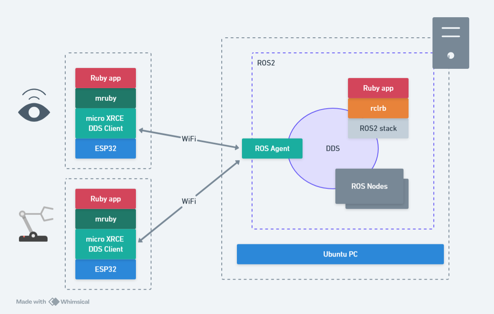

# micro-ros-mruby

## ROSConJP Proposalの誤記訂正(will be removed...)

RubyKiagiTakeout 2021 > RubyKiagiTakeout 2020

## Architecture



## Target

ESP32/ESP32-S3

## Build

Use ESP-IDF v5.4.1.

```
docker run -it --rm -v $PWD:/project buildcontainer-micro-ros-mruby idf.py build
```

TBD...


## License

This project is licensed under the MIT License.  
However, it includes submodules/components under different licenses:

- `components/micro_ros_espidf_component` : Apache License 2.0
- `components/mruby_component/mruby` : MIT

Please refer to each submodule's LICENSE file for details.
